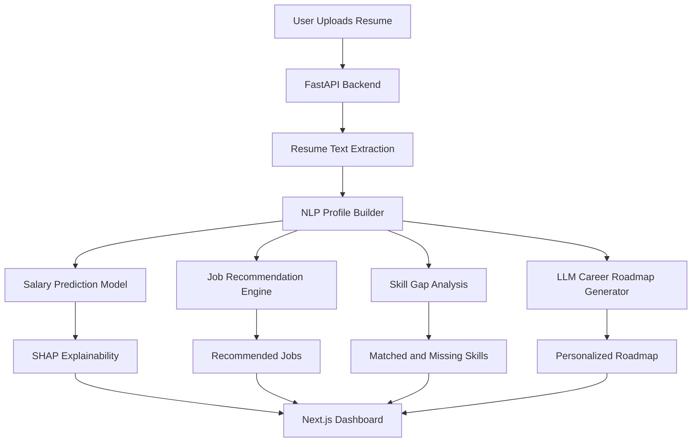

# AI Career Intelligence Platform

An end-to-end AI-powered career analytics platform that analyzes resumes, recommends suitable job roles, predicts salary, explains salary decisions using SHAP, identifies skill gaps, and generates personalized career roadmaps using LLMs.

This project is built as a production-style AI/ML application with a FastAPI backend, machine learning pipelines, explainable AI, NLP-based resume parsing, and a deployed Next.js frontend.

---

## Live Demo

**Frontend:** https://ai-career-intelligence-alpha.vercel.app
**Backend API:** Add your Hugging Face Space API link here
**GitHub:** https://github.com/Swyam668/ai-career-intelligence

---

## Overview

AI Career Intelligence helps users understand their career profile by uploading a resume and receiving structured insights such as:

* Extracted candidate profile
* Recommended job roles
* Matched and missing skills
* Predicted salary
* SHAP-based salary explanation
* Personalized AI-generated career roadmap

The main goal of this project is to combine **Machine Learning, NLP, Explainable AI, LLMs, and Full-Stack Development** into one practical career intelligence system.

---

## Key Features

### Resume Parsing and Candidate Profile Extraction

The system extracts useful information from uploaded resumes, including:

* Skills
* Education level
* Experience
* Certifications
* Target job profile
* Candidate attributes required for ML models

The resume parsing pipeline uses NLP-based processing and structured feature extraction to convert raw resume text into a machine-readable candidate profile.

---

### Job Recommendation Engine

The platform recommends suitable job roles based on the candidate profile.

It compares the candidate’s skills and profile with job data and returns relevant job recommendations along with:

* Job title
* Role
* Required qualifications
* Experience requirement
* Similarity score
* Skill match percentage
* Matched skills
* Missing skills

---

### Skill Gap Analysis

For each recommended job, the system identifies:

* Skills already present in the resume
* Skills missing for the role
* Match percentage between candidate and job requirements

This helps candidates understand what they need to improve for specific roles.

---

### Salary Prediction

The salary prediction module estimates salary using machine learning based on features such as:

* Job title
* Education level
* Experience
* Skills count
* Certifications
* Company size
* Location
* Remote work preference

The model was trained on a structured salary dataset with **250,000 records**.

---

### SHAP Explainability

The project uses SHAP to explain salary predictions.

Instead of only showing a salary number, the system explains how each feature affected the predicted salary.

Example explanation:

* Location lowered the estimate
* Experience level affected the estimate
* Skills count increased the estimate
* Job title contributed positively or negatively

This makes the ML output more transparent and interpretable.

---

### AI Career Roadmap Generation

The platform uses an LLM-based roadmap generator to create a personalized career improvement plan based on:

* Candidate profile
* Recommended jobs
* Missing skills
* Current skill level
* Target roles

The roadmap helps users understand what to learn next and how to move closer to their desired career path.

---

## Tech Stack

### Backend

* Python
* FastAPI
* Scikit-learn
* Sentence Transformers
* SHAP
* Pandas
* NumPy
* Joblib
* Google Gemini API
* Docker

### Frontend

* Next.js
* TypeScript
* Tailwind CSS
* React Context API
* Vercel Deployment

### Machine Learning / AI

* Salary Prediction Model
* NLP Resume Parsing
* TF-IDF / Similarity-based Job Recommendation
* Sentence Transformers
* SHAP Explainability
* LLM-based Roadmap Generation

### Deployment

* Backend: Hugging Face Spaces
* Frontend: Vercel
* Containerization: Docker

---

## Machine Learning Performance

### Salary Prediction Model

| Metric       |           Score |
| ------------ | --------------: |
| R² Score     |            0.96 |
| MAE          |          ₹5,436 |
| RMSE         |          ₹7,125 |
| Dataset Size | 250,000 records |

The salary prediction model was evaluated using standard regression metrics. Linear Regression performed strongly on the structured salary dataset and was selected due to its high accuracy, interpretability, and fast inference.

---

## System Architecture


## Architecture and Design Tradeoffs

The project follows a modular full-stack AI architecture where the frontend, backend APIs, ML models, explainability layer, and LLM-based roadmap generator are separated into independent components. The Next.js frontend handles user interaction and dashboard rendering, while the FastAPI backend manages resume upload, text extraction, profile generation, job recommendation, salary prediction, SHAP explanations, and roadmap generation.

A key design decision was to keep ML inference inside the backend instead of running it on the frontend. This keeps model files, preprocessing logic, and API keys secure while making the frontend lightweight and easier to deploy. The backend returns structured JSON responses, which makes the system easier to integrate with different clients in the future.

For job recommendation, the project uses similarity-based matching because it is fast, interpretable, and suitable for a portfolio-scale system. The tradeoff is that TF-IDF and basic similarity methods may miss deeper semantic meaning compared to transformer-based retrieval. Sentence Transformers can improve semantic matching, but they increase model size, inference cost, and deployment complexity.

For salary prediction, Linear Regression was selected because it performed strongly on the structured dataset while remaining fast and explainable. More complex models like Random Forest or Gradient Boosting could capture non-linear patterns, but they were slower and less transparent. Since the project also uses SHAP explanations, interpretability was prioritized over unnecessary model complexity.

The roadmap generator uses an LLM to produce personalized career guidance. This makes the output more flexible and human-like, but it introduces dependency on an external API, possible latency, and occasional inconsistency. To reduce this risk, the system can use fallback rule-based roadmap logic when the LLM is unavailable.

Overall, the architecture prioritizes practical deployment, explainability, modularity, and end-to-end usability over building the most complex possible ML system.


---

## Project Workflow

```text
Resume PDF
   ↓
Text Extraction
   ↓
Candidate Profile Builder
   ↓
ML / AI Modules
   ├── Job Recommendation
   ├── Skill Gap Analysis
   ├── Salary Prediction
   ├── SHAP Explanation
   └── AI Roadmap Generation
   ↓
Structured JSON Response
   ↓
Next.js Dashboard
```

---

## API Response Example

```json
{
  "profile": {
    "job_title": "Machine Learning Engineer",
    "education_level": "Bachelor",
    "industry": "Tech",
    "company_size": "Medium",
    "location": "India",
    "remote_work": "No",
    "experience_years": 0,
    "skills_count": 18,
    "certifications": 0
  },
  "recommendations": [
    {
      "job_title": "Data Scientist",
      "role": "Machine Learning Engineer",
      "similarity_score": 0.4296,
      "match_percentage": 75,
      "matched_skills": [
        "machine learning",
        "python",
        "deep learning"
      ],
      "missing_skills": [
        "model evaluation"
      ]
    }
  ],
  "salary_prediction": {
    "predicted_salary": 81457.26,
    "explanations": [
      {
        "feature": "skills_count",
        "impact": 7241.87,
        "effect": "positive"
      },
      {
        "feature": "experience_years",
        "impact": -28752.02,
        "effect": "negative"
      }
    ]
  }
}
```

---

## Folder Structure

```text
ai-career-intelligence/

├── app.py
├── requirements.txt
├── Dockerfile
├── README.md
│
├── data/
│   └── processed/
│
├── models/
│   ├── salary_prediction_pipeline.pkl
│   ├── tfidf_vectorizer.pkl
│   └── job_vectors.pkl
│
├── pipelines/
│   └── inference.py
│
├── salary/
│   └── shap_explainer.py
│
├── roadmap_generator/
│   └── roadmap_generator.py
│
├── utils/
│   └── pdf_parser.py
│
└── docs/
    └── screenshots/
```

---

## Local Setup

### 1. Clone the repository

```bash
git clone https://github.com/Swyam668/ai-career-intelligence.git
cd ai-career-intelligence
```

### 2. Create a virtual environment

```bash
python -m venv venv
```

Activate it:

```bash
# Windows
venv\Scripts\activate
```

```bash
# macOS/Linux
source venv/bin/activate
```

### 3. Install dependencies

```bash
pip install -r requirements.txt
```

### 4. Create environment variables

Create a `.env` file in the root directory:

```env
GOOGLE_API_KEY=your_gemini_api_key
```

### 5. Run the FastAPI server

```bash
uvicorn app:app --reload
```

The backend will run at:

```text
http://localhost:8000
```

API documentation will be available at:

```text
http://localhost:8000/docs
```

---

## Docker Setup

### Build the Docker image

```bash
docker build -t ai-career-intelligence .
```

### Run the container

```bash
docker run -p 7860:7860 --env-file .env ai-career-intelligence
```

---

## Main API Endpoints

| Endpoint            | Method | Description                           |
| ------------------- | ------ | ------------------------------------- |
| `/analyze-resume`   | POST   | Uploads and analyzes resume           |
| `/generate-roadmap` | POST   | Generates personalized career roadmap |
| `/docs`             | GET    | FastAPI Swagger documentation         |

Update this table if your endpoint names are different.

---

## What Makes This Project Strong

This project is not limited to a simple ML notebook. It demonstrates:

* End-to-end ML pipeline development
* Resume parsing and NLP-based profile extraction
* Recommendation system logic
* Regression model training and evaluation
* Explainable AI using SHAP
* LLM API integration
* Backend API development with FastAPI
* Frontend integration using Next.js
* Deployment using Vercel, Docker, and Hugging Face Spaces

---

## Future Improvements

* Replace TF-IDF recommendation with stronger neural embeddings
* Add user authentication and saved analysis history
* Improve resume parsing for complex resume formats
* Add more job market datasets
* Add detailed learning resources for each missing skill
* Add downloadable career reports
* Improve roadmap generation with role-specific timelines
* Add model monitoring and feedback-based improvement

---

## Author

**Swayam Vatwani**
B.Tech CSE, NIT Delhi
GitHub: https://github.com/Swyam668

---

## License

This project is for educational and portfolio purposes.
